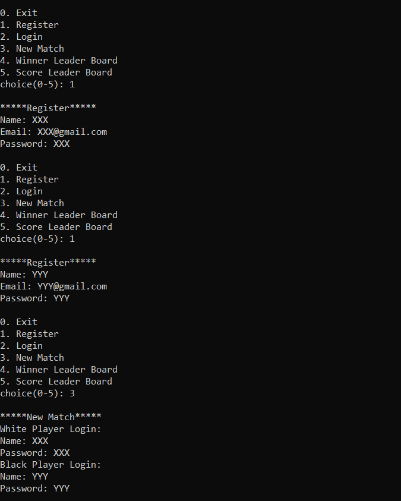
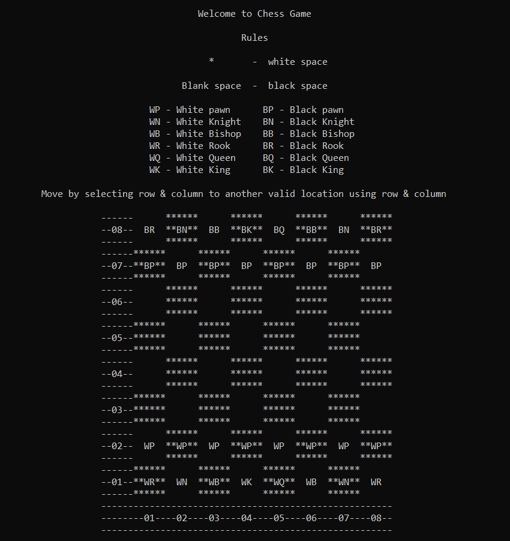
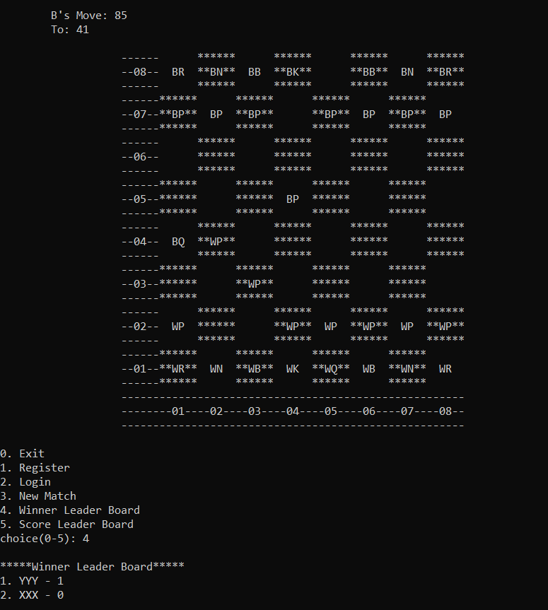

# Two-Player-Chess-Basic

This is a console-based game that simulates the basic moves of two player chess. 
This project demonstrates the use of object oriented programming concepts in C++.

## Table of Content

- [Demo](#demo)
- [Tech-Stack](#tech-stack)
- [Features](#features)
- [Installation and Usage](#installation-and-usage)
- [References](#references)

## Demo

<center>
    
</center>

<center>
    
</center>

<center>
    
</center>

## Tech-Stack

- C++
- Object Oriented Programming

## Features

- The game allows two players to enter their names and choose their colors (white or black) before starting the game.
- The game displays the chess board and the pieces on the console using ASCII characters.
- The game validates the moves of each player according to the rules of chess and updates the board accordingly.
- The game detects check, checkmate, stalemate, and draw situations and announces the result of the game.

## Installation-and-Usage

To run this game, you need to have a C++ compiler installed on your system. You can use any IDE or code editor that supports C++.

To download the code files for this project, you can clone this GitHub repository using the following command:

```
git clone https://github.com/Amritha-07/Two-Player-Chess-Basic.git
```

## References

This project was inspired by and based on the following sources:

- [Chess](https://gist.github.com/geocachecs/d8d2f402b0843231231b) by geocachecs
